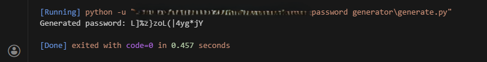

# Password Generator
This project is based on FreeCodeCamp (FCC) Scientific Computing with Python curriculum. This tool is to help generate passwords that are actually hard to crack (yeah, say goodbye to 'password123' lol) and it's not just *random gibberish* that'll pop up when you run it, **no**. It uses `Regex` to make sure every password has the right mix of symbols, numbers, and letters. And this is what it looks like when I run the code:

## Features
* **Customizable Length**: Set exactly how long you want your password to be (defaults to 16 characters).
* **Security-Focused**: Uses the secrets module, which is cryptographically stronger than the standard random library.
* **Smart Constraints**: You can specify a minimum count for numbers, special characters, uppercase, and lowercase letters.
* **Guaranteed Quality**: The script doesn't just hope for the best; it checks the password against your rules and re-generates it if they aren't met.

## Project Structure
Inside this repository, you will find:
* `generate.py` — The main Python script to generate password.
* `README.md` — The documentation you are reading right now.
* `output.png` — A screenshot of an example output when you run the code.

## Things I have learned from this project:
* **Python module**: How to use `import string`, `random`, and `secrets`. Now I understand that the dot `.` is used to "access" functions inside a module.

* **Variables & Data Types**: The difference between list `[]`, tuple `()`, and string `''`.

* **Looping**: Learned how to use `for _ in range()`. Using an underscore `_` as a throwaway variable when the index isn't needed.

* **Dunder (Double Underscore)**: Learned how to use `if __name__ == '__main__':` to use the function when this file got imported to another file.

* **Regular Expression (regex)**: 
    * The usage of `re.compile()` to prepare search patterns, `[a-z]` for matching lowercase letters, and `[0-9]` for finding digits.
    * The difference between `re.search()` (finds the first match) and `re.findall()` (collects all matches)
    * The analogy of using `\n` in **Normal String** and **Raw String**

        * **Normal String**: Python is like a "helpful" assistant who sees `\n` and thinks, *"Oh! He wants a New Line (`Enter key`) here!"* and he actually hits the `Enter key`.

        * **Raw String**: Python is like a photocopier. It doesn't think. It just sees a `\` and a `n`, and it prints exactly a `\` and a `n`. 

## How The Logic works
The script follows a "generate and verify" loop to make sure your password is both random and compliant with your rules. Here is the step by step:

1. **Character Pool**: It creates a massive list of every possible character—letters (big and small), numbers, and symbols.

2. **Random Selection**: It picks characters at random from that pool until it reaches your desired length.

3. **The "Safety Check"**: Instead of just giving you the password, it uses Regular Expressions (Regex) to count how many digits, symbols, and letters are actually in the result.

4. **Validation Loop**: If the password meets all your minimum requirements (e.g., at least one number, one symbol, etc.), the loop breaks and returns the password. But if it fails even one requirement, it throws that password away and starts back at *Step 2*.